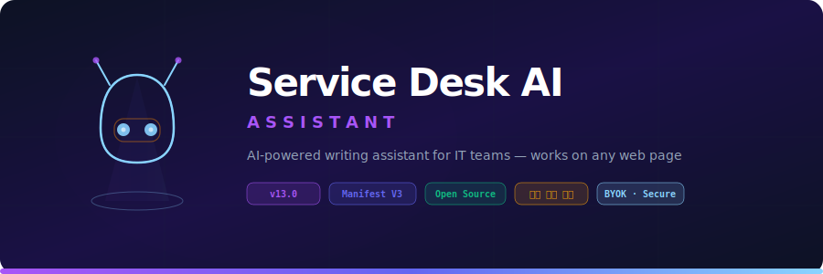
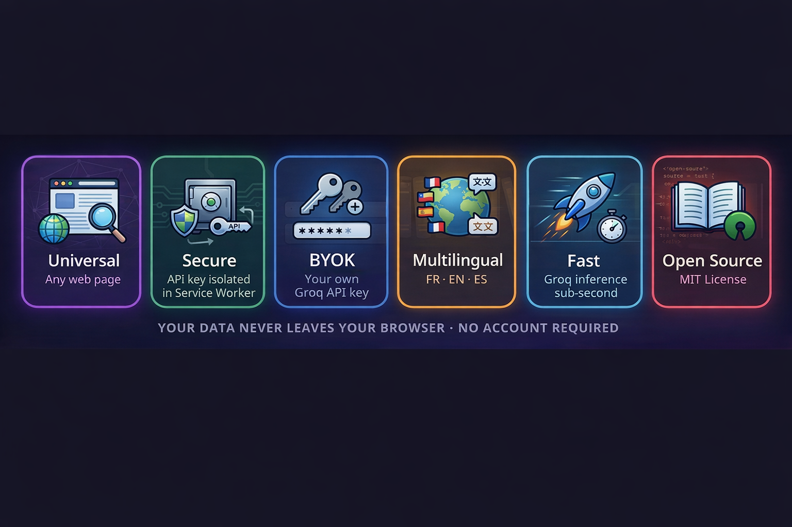
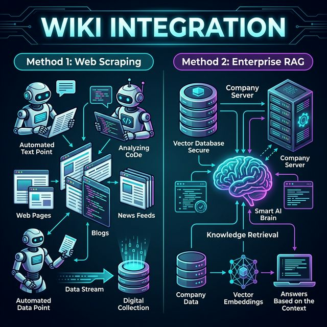
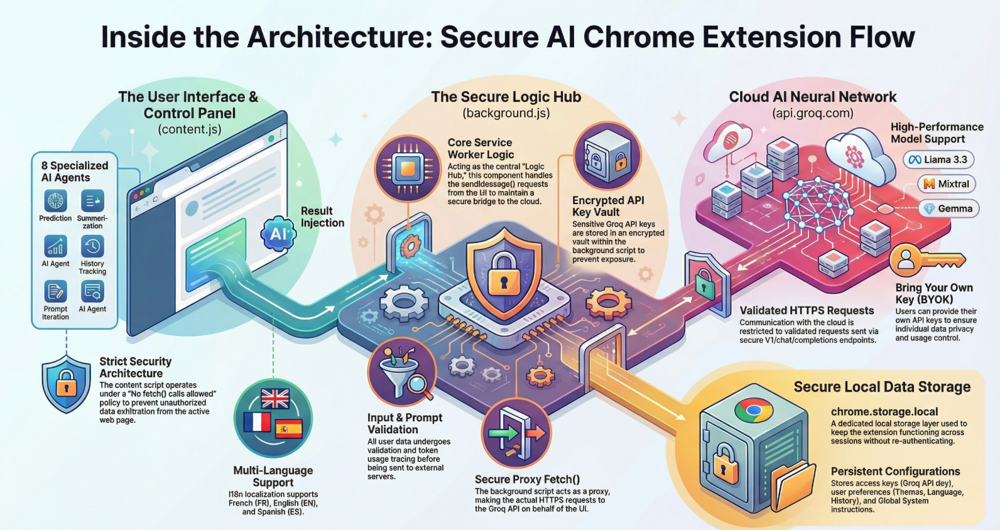
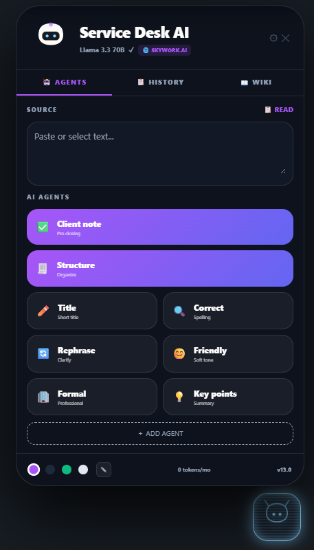
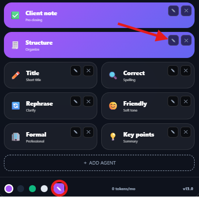
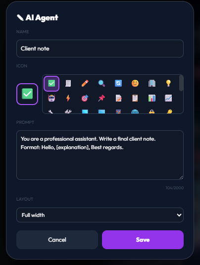
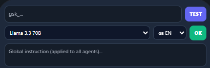
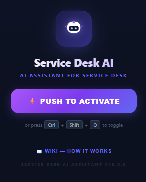
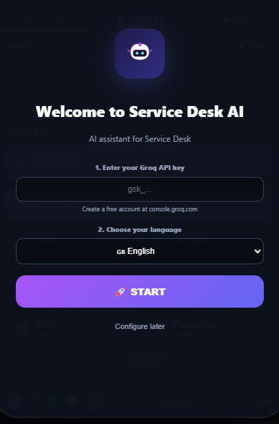

<div align="center">
  

  <h3><b>Your AI Copilot that follows you on every web page. No tabs. No copy-pasting. Just pure productivity.</b></h3>

  <p align="center">
    <a href="#-quick-install"></a><!--
    --><!--
    --><!--
    --><!--
    -->
  </p>
</div>

<br>

<div align="center">
  
</div>

---

## ⚡ The Problem

You write the same things every day — client notes, email corrections, reformulations, summaries. You tab out to ChatGPT, paste text back and forth, reformat the output, lose context. It breaks your flow.

**Service Desk AI Assistant lives where you work.** It injects a beautifully designed, draggable AI panel directly into your current web page. Select text, pick an agent, get the result — without ever leaving the page. One click to copy. One click to inject it back.

---

## ✨ Features (v13.0.0)

### 🪄 Holographic & Draggable UI
- **Draggable Panel:** Move the assistant anywhere on your screen. Features a stunning *Star Dust* particle effect while dragging.
- **Hologram Avatar:** A sleek, glowing vector robot icon that matches modern aesthetic standards.
- **4 Premium Themes:** Midnight, Obsidian, Aurora, and Ivory.

### 🧠 8 Customizable Agents
- **Out of the box:** Correct, Rephrase, Formal, Friendly, Structure, Title, Summary, and Client Note.
- **Fully Editable:** Create your own agents! Customize prompts, assign unique emojis, and tailor the exact layout you need.
- **Iterate & Refine:** Don't like the first result? Just type "make it shorter" or "add a greeting" to iterate dynamically.

### 🛡️ Enterprise-Grade Security (BYOK)
- **Zero Dependencies:** Built entirely in Vanilla JS (ES6+). Utterly lightweight and secure.
- **Bring Your Own Key (BYOK):** Uses your personal Groq API key (`gsk_...`). 
- **Isolated Execution:** Your API key is safely stored in `chrome.storage.local` and proxied exclusively via the **Service Worker** (`background.js`). It **never** touches the page's DOM or JavaScript context.

### 📚 Dual Wiki Integration System
Service Desk AI Assistant seamlessly connects to your enterprise knowledge base to provide perfectly contextualized answers:
- **Method 1: Web Scraping** - The assistant dynamically reads and extracts data directly from the active wiki or documentation pages you visit.
- **Method 2: Enterprise RAG** - Connects securely to a Retrieval-Augmented Generation (RAG) backend and vector database for deep, institutional knowledge retrieval.

<div align="center">
  
</div>

### 🛠️ How to Test & Configure the Wiki Integration

**1. Web Scraping (Client-Side)**
Once fully enabled, testing this method requires zero configuration. Simply navigate to your target internal wiki or documentation page, open the Service Desk AI Assistant, and use your agents. The extension's content script will securely read the current DOM to provide exact page context to the LLM.

**2. Enterprise RAG (Server-Side)**
To test the RAG method, you will need to connect the assistant to your existing vector database and orchestration backend (like LangChain or LlamaIndex).
- Go to the **Settings** panel of the extension.
- Replace the default API URL with your custom RAG endpoint.
- The assistant will then forward user queries to your backend, which will securely retrieve institutional documents before generating the final response.

### 🌍 Native i18n & Context Menu
- **3 Built-in Languages:** Full UI & Prompt support in French 🇫🇷, English 🇬🇧, and Spanish 🇪🇸.
- **Right-Click Magic:** Select any text, right-click, and run an AI agent instantly via the Context Menu.

---

## 🚀 Quick Install

```bash
git clone https://github.com/Geniiius/service-desk-ai-assistant.git
```

1. Open **`chrome://extensions/`** in Google Chrome.
2. Enable **Developer Mode** (top-right toggle).
3. Click **Load unpacked** and select the cloned project folder.
4. **⚠️ IMPORTANT (Activation):** When clicking `Push to Activate` from the extension popup, **you must refresh the page (F5)** to fully load the assistant into the active tab. *(Chrome's Manifest V3 security strictly isolates scripts until a refresh occurs).*
5. Follow the beautiful Onboarding Wizard to enter your API key and language.

### 🔑 Groq API Key & Local Alternatives
Service Desk AI Assistant uses **Groq** by default. It is an excellent, free alternative to paid APIs, featuring lightning-fast inference on models like Llama 3.3 70B:
1. Go to [console.groq.com](https://console.groq.com) and create a free account.
2. Go to **API Keys** → **Create** → Copy your key (`gsk_...`).
3. Paste it directly into the extension's Onboarding Wizard or Settings Panel.

> **🔐 Privacy Note:** Data sent via the Groq API is **not** used to train their models. Your client notes and internal texts remain confidential, unlike free web-based chats.
> 
> **⚠️ Note on API Limits:** While Groq's free tier is incredibly fast, it enforces **Token Rate Limits** (Tokens Per Minute/Day). If you process a massive volume of long client tickets daily, you might hit these limits.
>
> **💡 Local Alternative:** For users who want absolute privacy and zero limits, the assistant's architecture allows it to easily connect to local models (such as **Ollama** or **LM Studio**) instead of Groq. *(Coming in a future update — see Roadmap).*

---

## 🏗 Architecture Under the Hood

<div align="center">
  
</div>

<br>

<div align="center">
  
</div>

* **Content Script (`content.js`):** Manages the entire UI injection, the Draggable logic, rendering the Star Dust effects, i18n, and History. It **never** makes network requests itself.
* **Service Worker (`background.js`):** Acts as a secure tunneling proxy. It manages the API connection, handles right-click context menus, and sanitizes input to prevent XSS.

---

## 📸 Gallery

<details>
<summary><b>Click to expand Screenshots</b></summary>
<br>

| View | Screenshot |
|------|------------|
| **Demo (Dark)** |  |
| **Agent Grid** |  |
| **Agent Editor** |  |
| **Settings** |  |
| **Extension Popup** |  |
| **Onboarding Wizard** |  |

> *Note: Place your own visual assets in `docs/screenshots/` to display them here.*
</details>

---

## 📋 Roadmap
- [ ] **Streaming generation:** Show text character-by-character as it generates.
- [ ] **Agent Packs:** Import/Export agent configurations for IT, Marketing, or Academic teams via JSON.
- [ ] **Multi-provider Support:** Fallbacks for OpenAI, Anthropic, or Local Ollama models.
- [ ] **Chrome Web Store Publication.**

---

## 🤝 Contributing
Contributions, issues, and feature requests are very welcome. See [CONTRIBUTING.md](CONTRIBUTING.md) for guidelines.

```bash
git checkout -b feature/my-amazing-feature
git commit -m "feat: added streaming generation"
git push origin feature/my-amazing-feature
```

## 📄 License
Released under the [MIT License](LICENSE). Free to use, modify, and distribute.

<br>
<p align="center">
  <sub>Build by <a href="https://github.com/Geniiius">InnSaeI ( Geniius )</a></sub>
</p>
